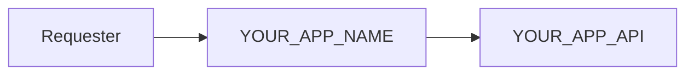

# YOUR_APP_NAME

## 📘 About

YOUR_APP_NAME คือ Template ของ create-react-app สำหรับเว็บแอพลิเคชั่น ที่ใช้เฉพาะใน BAAC เท่านั้น

## 📦 Built With

- [x] React JS
- [x] Ant Design

## ⚒ Structure



## 📋 Features

- `/signin` via iAuthen

## 📝 Test Cases

No Data

## ⚙ Get Started

1. Clone project

    ```bash
    git clone {IPANDA_LINK_TO_YOUR_APP}
    ```

2. Go to project folder

    ```bash
    cd YOUR_APP_NAME
    ```

3. Set up environment by command

    ```bash
    yarn

    # or use `yarn install`
    ```

4. Run project by command

    ```bash
    # Normal Mode
    yarn dev

    # Build Mode
    yarn build
    ```

## 📌 REMARK

กรุณาแก้ไขรายละเอียดหลังสร้าง project ใหม่ที่ไฟล์ดังนี้

- .env ต่างๆ

- package.json

- IPANDA_LINK_TO_YOUR_APP, YOUR_APP_NAME และ YOUR_APP_DESCRIPTION รวมไปถึงชื่อต่าง ๆ ที่คล้ายกัน
