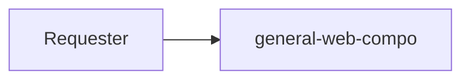

# general-web-compo

## 📘 About

general-web-compo คือ Template ของ create-react-app สำหรับเว็บแอพลิเคชั่น ที่ใช้เฉพาะใน BAAC เท่านั้น

## 📦 Built With

- [x] React JS
- [x] Ant Design

## ⚒ Structure



## 📋 Features

- `/` Main Page

## 📝 Test Cases

No Data

## ⚙ Get Started

1. Clone project

    ```bash
    git clone {GIT_LINK}
    ```

2. Go to project folder

    ```bash
    cd general-web-compo
    ```

3. Set up environment by command

    ```bash
    yarn

    # or use `yarn install`
    ```

4. Run project by command

    ```bash
    # Normal Mode
    yarn dev

    # Build Mode
    yarn build
    ```
